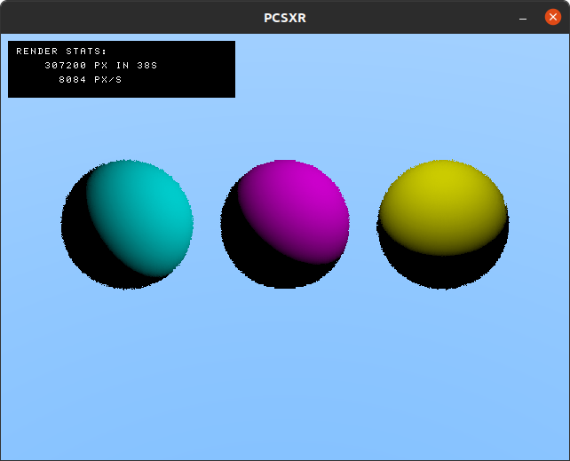

# PSX raytracer

A toy raytracer for the PSX I started creating for fun. First time doing something for the PSX (and C89, for that matter).
Still very much hacked together code, see task list at the bottom for possible next steps.

TODO technical (or look into):
* if using a larger OT and reverse DMA can aid performance
* struct padding/packing
* offload calculations to GTE (where possible?)
* hand optimized MIPS where useful (and make use of delay slots, stalling for mul/div/gte ops)
* different scales for fixed point?
* improve intersection calculations where possible
* render background using standard polys
* perhaps undo typedeffing structs everywhere
* -insert technical improvement-

TODO features:
* fix plane rendering
* shadow intersections
* multisampling
* path tracing
* -insert rendering features- 